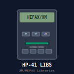

# hp-41_libs_xm_hepax

 

## HP-41: Libraries for handling XM and HEPAX files

**NOTE:** These programs are part of the ISENE.ROM (https://github.com/isene/hp-41_isene-rom). The FOCAL listing can be found in the "src" folder of that project. Any updates and new versions will be found there.

### LIBXM

This library contains functions for handling eXtended Memory files:

* FLSORT: Alphabetically sorts an XM file (file name in alpha)
* FLSZ+: Ensures the XM file (name in Alpha) has room for 4 more records
* FLSZ-: Trims the XM file (name in Alpha)
* SKPTACR: Sets the file pointer of file to 0. Creates file if it doesn’t exist
* XMFILE?: Return the current XM file name in Alpha. This function requires the ICEBOX rom

### LIBHPX

This library contains functions for handling HEPAX files:

* HSAVEAS: Saves XM ASCII file (name in Alpha) to HEPAX memory
* HSAVED: Saves XM data file (name in Alpha) to HEPAX memory
* HGETAS: Retrieves HEPAX ASCII file (name in Alpha) to XM
* HGETD: Retrieves HEPAX data file (name in Alpha) to XM
* HRESZFL: Resizes HEPAX ASCII file (name in Alpha) to specified size (in X)

## License
This software is released into the Public Domain.

